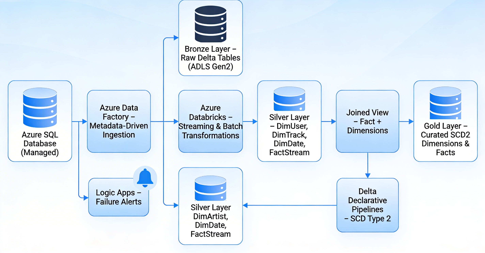

# spotify-azure-medallion-pipeline

## Overview

This project implements an end‑to‑end medallion architecture on Azure using metadata‑driven pipelines for incremental ingestion, streaming transformations in Databricks, and a Type 2 SCD gold layer built with Delta.

## Architecture

## Architecture

## Architecture

  

- **Source**: Azure SQL Database (managed) as the system of record.
- **Orchestration**: Azure Data Factory (ADF) metadata‑driven pipelines for incremental ingestion and backfilling.
- **Storage**: Azure Data Lake Storage Gen2 with bronze, silver, and gold containers following medallion architecture.
- **Processing**: Azure Databricks (PySpark, Delta Lake, streaming tables).
- **Alerts**: Azure Logic Apps for pipeline failure notifications.
- **Modeling**: Dimension and fact tables, including Type 2 Slowly Changing Dimensions (SCD2) in the gold layer.

### End‑to‑End Flow

1. Azure SQL DB → ADF metadata‑driven ingestion → Bronze Delta tables.
2. Bronze → Databricks streaming/batch transformations → Silver dimensional & fact tables.
3. Silver → Delta declarative pipeline with SCD2 logic → Gold curated tables.

You can render the architecture diagram directly in this README using Mermaid (see “Architecture Diagram” section below).

## Features

- **Metadata‑driven ingestion**
  - Single generic ADF pipeline drives ingestion for multiple tables based on metadata (table list, keys, watermarks).
  - Supports both incremental loads and full backfills without changing pipeline logic.

- **Bronze layer (raw landing)**
  - Ingests data from Azure SQL DB into a bronze ADLS container as Delta/Parquet.
  - Preserves raw schema and uses append‑only pattern for auditability.

- **Silver layer (cleansed dimensions and facts)**
  - Databricks notebooks/Jobs transform bronze data into:
    - `DimUser`
    - `DimTrack`
    - `DimArtist`
    - `DimDate`
    - `FactStream` (or equivalent streaming fact table)
  - Uses streaming tables / incremental patterns to process new data.

- **Gold layer (business‑ready SCD2)**
  - SQL view joins fact with `DimUser` and `DimTrack` to create a unified business view.
  - Delta declarative pipeline implements SCD Type 2 (effective dates + current flag) over this view.
  - Writes final SCD2 dimension tables and curated fact tables into the gold layer.

- **Monitoring and alerting**
  - ADF pipeline failures trigger a Logic Apps workflow.
  - Logic App sends alerts (email/Teams/etc.) with pipeline name, error message, and timestamp.

## Tech Stack

- Azure Data Factory
- Azure Data Lake Storage Gen2
- Azure SQL Database (Managed)
- Azure Databricks (PySpark, Delta Lake, streaming tables)
- Delta Live / Delta declarative pipelines
- Azure Logic Apps

## Data Model

### Silver Layer Objects

- **DimUser**
  - User surrogate key, business key, attributes such as country, subscription tier, etc.
- **DimTrack**
  - Track key, title, album, genre, duration, etc.
- **DimArtist**
  - Artist key, name, and related attributes.
- **DimDate**
  - Standard calendar dimension with date, day, month, quarter, year, etc.
- **FactStream**
  - Records streaming/usage events with foreign keys to user, track, date, plus metrics (plays, skips, etc.).

### Gold Layer Objects

- **SCD2 dimensions (e.g., `DimUser_SCD2`)**
  - Surrogate key
  - Business key
  - Descriptive attributes
  - `EffectiveFrom`, `EffectiveTo`
  - `IsCurrent` flag
- **Curated fact tables**
  - Aggregated and denormalized fact tables optimized for analytics and reporting.

## Pipeline Details

### 1. Ingestion: Azure SQL DB → Bronze

- ADF metadata‑driven pipeline:
  - Uses a configuration table/JSON to store:
    - Source table name
    - Source query
    - Primary/business key
    - Watermark column (e.g., `LastUpdatedDate`)
    - Target path in bronze container
  - Typical activities:
    - Get Metadata / Lookup → ForEach over the table list.
    - Copy activity to move data from Azure SQL DB to ADLS bronze.
    - Incremental logic using watermark values, with backfill support when required.

- Failure handling:
  - OnError branch triggers a Logic Apps HTTP endpoint.
  - Logic App sends an alert with run details.

### 2. Transformations: Bronze → Silver (Databricks)

- Databricks notebooks:
  - Read from bronze Delta tables.
  - Apply cleansing, type casting, deduplication, and business rules.
  - Build `DimUser`, `DimTrack`, `DimArtist`, `DimDate`, and `FactStream`.
  - Write out as Delta tables in the silver schema/container.

- Streaming/Incremental pattern:
  - Uses streaming tables or Auto Loader style patterns (if configured) to continuously process new data.
  - Keeps the silver layer updated with low latency.

### 3. Curated: Silver → Gold (SCD2)

- View creation:
  - SQL view that joins `FactStream` with `DimUser` and `DimTrack` on the appropriate keys.
  - Acts as a unified input for SCD2 processing.

- Delta declarative SCD2 pipeline:
  - Reads from the joined view.
  - Uses Delta merge semantics to:
  - Writes SCD2 dimensions and curated facts into the gold layer.
